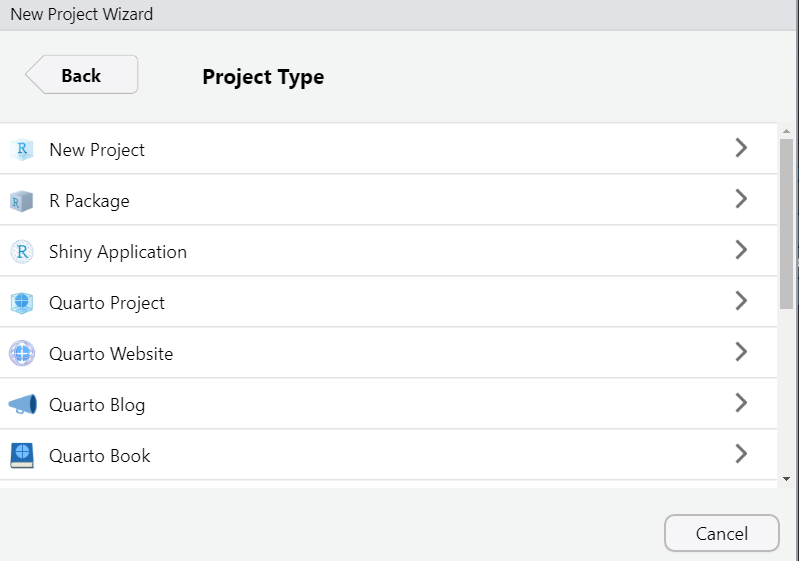
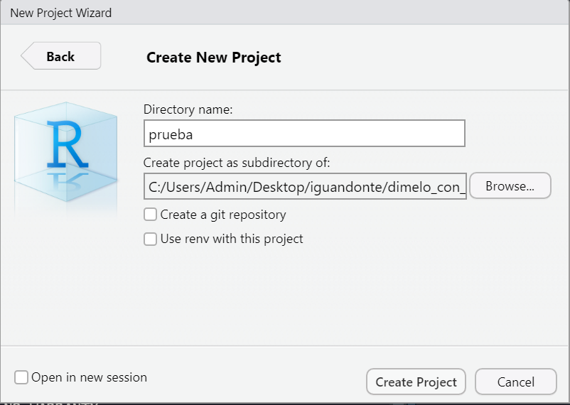
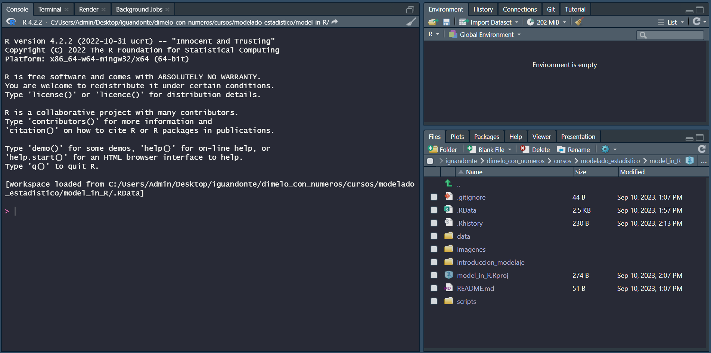

```{r setup, include=FALSE}
knitr::opts_chunk$set(echo = TRUE)
```

## Trabajando con proyectos

Antes de comenzar, vamos a generar un proyecto. Estos nos permiten organizar nuestro trabajo; tener imágenes, scripts, y datasets en un mismo sitio. Para esto, nos dirigiremos al apartado file, o archivo y seleccionaremos 'nuevo proyecto'

```{r imagen1, echo=FALSE, out.width = "60%", fig.align = "center"}
knitr::include_graphics(path = "nuevo_proyecto.png")
```


Se generará un apartado para nuestro nuevo proyecto. Por el momento nos enfocaremos solo en 'New directory'. En el apartado de 'tipo de proyecto' seleccionaremos 'nuevo proyecto'.

```{r imagen2, echo=FALSE, out.width="60%", fig.align='center'}

```

Ahora, indicaremos la ubicación donde se guardará el proyecto

```{r imagen3, echo=FALSE, out.width='60%', fig.align='center'}

```

A continuación, se reiniciará la sesión de R, destacando que nuestro apartado de folder ahora estará colocado en sitio donde se generó el proyecto.


```{r imagen4, echo=FALSE, out.width='60%', fig.align='center'}

```

De esta manera, todo lo que creemos puede ser guardado en una misma sesión. Asimismo, podemos cargar archivos sin la necesidad de buscar su ubicación completa en el sistema. En el siguiente ejemplo se generará una carpeta llamada data, posteriormente crearemos un data set llamado iris_df con la información de un conjunto de datos de prueba llamdo iris y lo guardaremos en esta carpeta. Por último, llamaremos de nuevo este conjunto de datos.

```{r carpeta, echo=TRUE, warning=FALSE, message=FALSE}
# para este apartado trabajaremos con la libreria readr de tidyverse
# en caso de no estar instalada usaremos el siguiente comando
# install.packages('readr')
# ahora, llamaremos la libreria
 library(readr)

# creando carpeta data
dir.create('data')

# generando un dataset con la informacion de irir
iris_df <- iris

# guardando el dataset
write.csv(iris_df, 'data/iris.csv', row.names = FALSE)

# de esta manera se carga el conjunto de datos en la carpeta.

# Para cargar lod datos utilizaremos la funcion read_csv() de readr
iris_df2 <- read_csv('data/iris.csv')
```

Antes de comenzar veremos brevemente los tipos de variables de trabajo más comúnes 

```{r variables, echo=TRUE}
# variables con un solo elemento
x <- 2 # tipo numérico
y <- 'A' # tipo caracter
# los vectores los cuales son un tipo de representación en una sola dimensión
z <- c(1,2,3,4,5) # Tipo numérico
a <- c('a', 'b', 'c') # tipo caracter
# los dataframes, representaciones de datos en dos dimenciones
b <- data.frame(nombre = c('juan', 'pedro', 'dulcinea'),
           edad = c(12,15,13),
           sexo = c('hombre', 'hombre', 'mujer'))
# listas, elemntos que pueden contener cualquier tipo de variables
c <- list(x,y,z,a,b)


```


con esta introducción al manejo de proyectos podemos comenzar con la clase

**Nota: una de las principales ventajas del lenguaje de programación R es el uso de vectores. La mayoría de los casos se limitarán a trabajar con ellos**

## Estadística descriptiva e inferencial

La estadística descriptiva suele ser el primer acercamiento analítico para entender el comportamiento de los datos. Visto de otra manera, se considera como un resumen de las variables más comunes de los datos. Asimismo, en esta categoría encontramos dos grupos, las medidas de tendencia central (media, moda, mediana) y las medidas de disperción (varianza, desviación típica). Además, se destacan otras medidas como el valor máximo, mínimo, y rango. Por mencionar algunos.


Por su parte, la estadística inferencial se encarga de generar predicciones desde la información presente en el conjunto de datos. Por ejemplo, definir las ventas del próximo mes a partir de las ventas del año pasado. Detallar la probabilidad de que ocurra un evento, dado la ocurrencia de otro. Entre estos podemos mencionar a los modelos lineales, series de tiempo, cadenas de Markov, solo por definir algunos ejemplos.


### Medidas de tendencia central

Comenzaremos con las medidas de tendencia central. Media aritmética, mediana, moda

La media aritmética es el promedio de un conjunto de valores. Para calcularla se suman todos los valores y se divide sobre el total de elementos. En R, se puede calcular mediante la función mean(). A continuación, calcularemos el promedio de los valores de *Sepal.Length*, *Sepal.Width*,  *Petal.Length*, y *Petal.Width* del conjunto de datos iris.

```{r promedio, echo=TRUE}
print(mean(iris$Sepal.Length))
print(mean(iris$Sepal.Width))
print(mean(iris$Petal.Length))
print(mean(iris$Petal.Width))
```

Todos los caminos conducen a Roma. Ahora vamos a calcular el promedio acorde a la fórmula. Tal vez no sea la manera más rápida, pero ten en cuenta que cuando programes no existirá una sola respuesta correcta.

```{r promedio2, echo=TRUE}
# primero vamos a sumar todos los valores de sepal length

suma <- sum(iris$Sepal.Length)

# ahora obtendremos el total de valores presentes en esta columna

valores <- length(iris$Sepal.Length)

# Por último, realizaremos la función descrita para la media aritmética

promedio <- suma/valores
print(promedio)

# si comparamos ambas funciones obtendremos el mismo resultado

print(promedio)
print(mean(iris$Sepal.Length))
```

**Nota: en ambos casos trabajamos solo con vectores, dejando de lado el resto de la información y sus dimensiones**

En ocasiones encontraremos conjuntos de datos con información faltante. Si utilizamos la función *mean()* de forma directa encontraremos un error

```{r error_mean, echo=TRUE}
d <- c(1, 3, 4, 2, 2, 1, 4, 5, NA, 6, 5, 4, 4)
mean(d)
```

Para ello podemos utilizar el argumento na.rm = TRUE, para eliminar el/los valores faltantes. Podemos acceder a los argumentos de las funciones mediante la función *help()*.

```{r error_mean2, echo=TRUE}
d <- c(1, 3, 4, 2, 2, 1, 4, 5, NA, 6, 5, 4, 4)
mean(d, na.rm = TRUE)
```
**Nota: uno de los problemas de la media es su poca sensibilidad a valores extremos**


La mediana es el valor que se encuentra en medio al ordenar un conjunto de datos. Este orden puede ser de manera ascendente o descendente. Cuando los datos tienden a la normalidad su valor es similar a la media aritmética. No obstante, cuando encotramos valores extremos, la mediana no sueleverse comprometida. Para obtener la mediana de un conjunto de datos se utiliza la función *median()*. A continuación realizaremos algunos ejemplos utilizando el set de datos iris.

```{r mediana, echo=TRUE}
print(median(iris$Sepal.Length))
print(median(iris$Sepal.Width))
print(median(iris$Petal.Length))
print(median(iris$Petal.Width))

```

Asimismo, si existen datos faltantes, es posible utilizar el argumento na.rm= TRUE

```{r MEDIAN_2, echo=TRUE}
d <- c(1, 3, 4, 2, 2, 1, 4, 5, NA, 6, 5, 4, 4)
median(d, na.rm = TRUE)
```

La moda es el valor con mayor repetición dentro de un conjunto de datos. Es decir, es aquel valor con la mayor frecuencia. Al igual que la mediana, si se aplica a un conjunto de datos que sigue la distribución normal, su valor será similar a la media aritmética. Dentro de la paquetería base de estadística en R no existe una función que permita calcular la moda. No obstante, descargaremos la paquetería *modeest* y utilizaremos la función mfv(). Para ello, instalaremos y llamaremos a esta paquetería en el flujo de trabajo.

```{r moda, echo=TRUE, warning=FALSE}
# install.packages('modeest')
library(modeest)

e <- c(2,2,2,4,1,5,6,7,5,5,3,5,2,5,4,5,5,8,9)
print(mfv(e))
```

Al igual que el resto de las funciones, al encontrar datos faltantes podemos omitirlos con el argumento na_rm = TRUE

```{r MODA2, echo=TRUE}
f <- c(2,2,2,4,1,5,6,7,NA,5,3,5,2,NA,4,NA,NA,8,9)
print(mfv(f, na_rm = TRUE))

```


### Medidas de dispersión


### Cuantiles(Cuartiles, deciles, percentiles)


### Otras medidas

